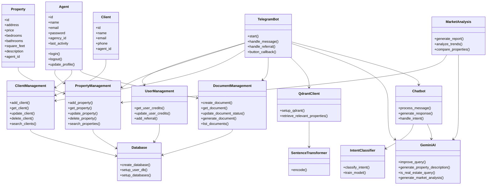

# Beda Top Real Estate Assistant


**Beda Top: AI-powered real estate assistant streamlining property searches and transactions.**

Beda Top Agent helps real estate agents with user onboarding, document preparation, market analysis, and client analysis, trained on agency data for personalized assistance. [Learn more about Beda Top Agent portal](https://agent-bot-front.vercel.app/)

---

## Showcase

Here's a glimpse of the Beda Top system in action:


*Beda Top Agent Dashboard - Manage properties, clients, and tasks at a glance*


*Beda Top AI Chatbot - Get instant assistance and property recommendations*

---

## Test Credentials

To quickly explore the Beda Top Agent portal, you can use the following test credentials:

- **Email:** test@mail.com
- **Password:** test

Please note that this is a test account with limited functionality. For full access, please contact our support team to set up your own account.

---

## Table of Contents
1. [Overview](#overview)
2. [Features](#features)
3. [System Components](#system-components)
4. [Requirements](#requirements)
5. [Installation](#installation)
6. [Configuration](#configuration)
7. [Usage](#usage)
8. [System Architecture](#system-architecture)
9. [Development](#development)
10. [License](#license)

## Overview

This Real Estate Assistant is a Telegram bot-based application designed to assist real estate agents in managing properties, clients, and documents. It leverages advanced technologies such as vector search capabilities (Qdrant) for efficient property matching and AI-powered text generation (Google's Gemini API) for improving queries and generating property descriptions.

## Features

- Property management and search
- Client information management
- Document preparation and management
- AI-powered query improvement and property description generation
- User credit system with referral bonuses
- Vector-based property search for efficient matching

## System Components

1. **Database**: SQLite databases for storing user, agent, property, client, and document information.
2. **QdrantClient**: Vector database for efficient property searching.
3. **SentenceTransformer**: Converts text descriptions into vector representations.
4. **TelegramBot**: Main interface for user interactions via Telegram.
5. **UserManagement**: Manages user credits and referral system.
6. **PropertyManagement**: Handles adding and retrieving property information.
7. **ClientManagement**: Manages client information.
8. **DocumentManagement**: Handles creation, retrieval, and management of property-related documents.
9. **GeminiAI**: Utilizes Google's Gemini API for natural language processing tasks.

## Requirements

- Python 3.7+
- Telegram Bot API Token
- Google API Key (for Gemini AI)

## Installation

1. Clone the repository:
   ```
   git clone https://github.com/bekhruzbekRakhmonov/beda_top_bot.git
   cd beda_top_bot
   ```

2. Install required dependencies:
   ```
   pip install python-telegram-bot python-dotenv sentence-transformers qdrant-client google-generativeai sqlite3 python-docx docx2pdf PyPDF2
   ```

## Configuration

1. Create a `.env` file in the project root directory.
2. Add the following environment variables:
   ```
   TELEGRAM_BOT_TOKEN=your_telegram_bot_token
   GOOGLE_API_KEY=your_google_api_key
   ```

## Usage

1. Start the bot:
   ```
   python main.py
   ```

2. In Telegram, start a conversation with your bot by sending the `/start` command.
3. Use the provided buttons to:
   - Add properties
   - Manage clients
   - Prepare documents
4. Use natural language queries to search for properties or get assistance.

## System Architecture

The system follows a modular architecture with the TelegramBot at its core, integrating various components for specific functionalities. The bot interacts with users, manages data through the Database component, uses QdrantClient for vector search, and leverages GeminiAI for text processing and generation.

### UML Diagram

