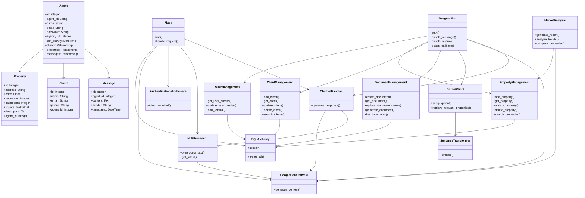

# Beda Top Real Estate Assistant


**Beda Top: AI-powered real estate assistant streamlining property searches and transactions.**

Beda Top Agent helps real estate agents with user onboarding, document preparation, market analysis, and client analysis, trained on agency data for personalized assistance. [Learn more about Beda Top Agent portal](https://agent-bot-front.vercel.app/)

---

## Showcase

Here's a glimpse of the Beda Top system in action:


*Beda Top Agent Dashboard - Manage properties, clients, and tasks at a glance*


*Beda Top AI Chatbot - Get instant assistance and property recommendations*

---

## Test Credentials

To quickly explore the Beda Top Agent portal, you can use the following test credentials:

- **Email:** test@mail.com
- **Password:** test

Please note that this is a test account with limited functionality. For full access, please contact our support team to set up your own account.

---

## Table of Contents
1. [Overview](#overview)
2. [Features](#features)
3. [System Components](#system-components)
4. [Requirements](#requirements)
5. [Installation](#installation)
6. [Configuration](#configuration)
7. [Usage](#usage)
8. [API Endpoints](#api-endpoints)
9. [System Architecture](#system-architecture)
10. [Team](#team)
11. [Development](#development)

## Overview

Beda Top Real Estate Assistant is a comprehensive system designed to assist real estate agents in managing properties, clients, and documents. It consists of two main components:

1. A web application with a Flask backend and pure HTML, CSS (Tailwind.css)and JavaScript frontend
2. A Telegram bot for mobile interactions

Both components leverage advanced technologies such as AI-powered text generation (Google's Gemini API) for improving queries, generating property descriptions, and providing intelligent chatbot responses. The system also uses vector search capabilities (Qdrant) for efficient property matching.

## Features

- User authentication and authorization
- Property management and search
- Client information management
- AI-powered chatbot for real-time assistance
- Document preparation and management
- AI-powered query improvement and property description generation
- Market analysis
- User credit system with referral bonuses
- Vector-based property search for efficient matching
- Telegram bot interface for mobile interactions

## System Components

1. **Flask Backend**: Handles API requests, database operations, and integrates with AI services.
2. **SQLAlchemy ORM**: For database management and operations.
3. **Google Generative AI**: Utilizes Google's Gemini API for natural language processing tasks.
4. **NLTK**: For natural language processing and intent classification.
5. **JWT**: For secure user authentication in the web application.
6. **React Frontend**: User interface for the web application (not included in this repository).
7. **TelegramBot**: Main interface for user interactions via Telegram.
8. **QdrantClient**: Vector database for efficient property searching.
9. **SentenceTransformer**: Converts text descriptions into vector representations.

## Requirements

- Python 3.7+
- Flask
- SQLAlchemy
- Google Generative AI API Key
- NLTK
- PyJWT
- Telegram Bot API Token
- Qdrant
- Sentence Transformers

## Installation

1. Clone the repository:
   ```
   git clone https://github.com/your-repo/beda_top_real_estate.git
   cd beda_top_real_estate
   ```

2. Install required dependencies:
   ```
   pip install -r requirements.txt
   ```

## Configuration

1. Create a `.env` file in the project root directory.
2. Add the following environment variables:
   ```
   DATABASE_URL=your_database_url
   GOOGLE_API_KEY=your_google_api_key
   JWT_SECRET_KEY=your_jwt_secret
   TELEGRAM_BOT_TOKEN=your_telegram_bot_token
   ```

## Usage

### Web Application
1. Start the Flask server:
   ```
   python app.py
   ```

2. The API will be available at `http://localhost:5000`.
3. Use the provided API endpoints to interact with the system.

### Telegram Bot
1. Start the bot:
   ```
   python main.py
   ```

2. In Telegram, start a conversation with your bot by sending the `/start` command.
3. Use the provided buttons to:
   - Add properties
   - Manage clients
   - Prepare documents
4. Use natural language queries to search for properties or get assistance.

## API Endpoints

- **POST /api/login**: User login
- **POST /api/create_agent**: Create a new agent account
- **POST /api/chatbot**: Interact with the AI chatbot
- **GET /api/properties**: Get all properties for the current agent
- **POST /api/properties**: Add a new property
- **GET /api/clients**: Get all clients for the current agent
- **POST /api/clients**: Add a new client
- **GET /api/agents/me**: Get current agent information
- **POST /api/messages**: Save a new message
- **GET /api/messages**: Get all messages for the current agent

All endpoints except login and create_agent require JWT authentication.

## System Architecture

The system follows a modular architecture with multiple components working together to provide a comprehensive real estate assistant solution.

### UML Diagram



## Team

Our dedicated team consists of three skilled professionals who have contributed their expertise to make Beda Top Real Estate Assistant a reality:

1. **Bekhruzbek Rakhmonov** - Product Manager, AI and Data Science Engineer, and Backend Developer
   - Led the project management efforts
   - Developed the architecture of the entire project
   - Implemented AI and data science components
   - Built the backend infrastructure

2. **Alex Dzhuraev** - Analyst/Market Researcher
   - Conducted comprehensive market research
   - Analyzed market needs and trends
   - Provided valuable insights for product development and feature prioritization

3. **Masharipov Quvondiq** - Tester
   - Rigorously tested every feature of the product
   - Ensured quality and reliability of the application
   - Provided feedback for improvements and bug fixes

The combined efforts of our team members have resulted in a robust, market-driven, and thoroughly tested product that meets the needs of real estate professionals.